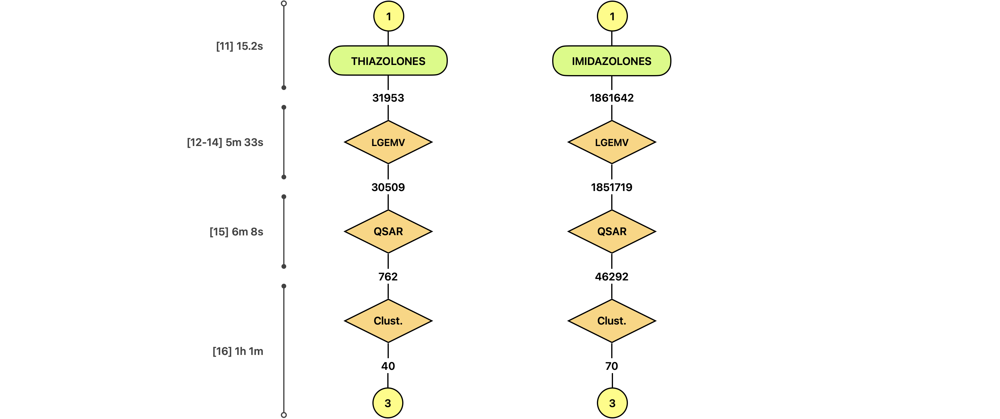
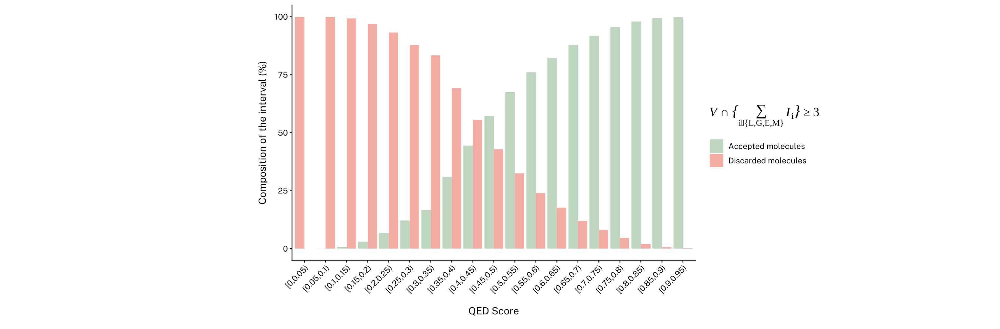

# PHASE 2: Hit Prioritisation (ML-QSAR and Custerisation)

This folder holds the data and code for Phase 2 of the project, which runs inside
`02_HIT_PRIORITISATION.ipynb`. The goal of this phase is to take the large virtual
libraries from Phase 1 and reduce them to a small, diverse, and purchasable shortlist
for docking in Phase 3.



---

## What this phase produces

Two CSV files, one per scaffold family, exported to [`02_selected_mols_data/outputs/`](outputs):

- `Imidazolones_<k>samples.csv`
- `Thiazolones_<k>samples.csv`

Each file contains one representative molecule per cluster — the compounds that survived
every filter and were selected as the most diverse, drug-like, and cost-effective candidates
for Phase 3 docking. The `<k>` in the filename is the number of clusters found.

---

## How to run it

Phase 2 requires the [`clustering`](modules/clustering.yml) conda environment:

```bash
conda env create -f 02_selected_mols_data/modules/clustering.yml
conda activate clustering
```

Then open and run `02_HIT_PRIORITISATION.ipynb` from the repo root. The notebook is
designed to resume safely if interrupted — cached results are reused automatically so
you only recompute what is necessary.

The main settings at the top of the notebook are:

- **`FORCE_RECOMPUTE`** — set to `True` to ignore cached drug-likeness scores and recompute from scratch.
- **`QSAR_ACCEPTANCE_RATE`** — fraction of compounds to keep after machine learning ranking (e.g. `0.05` keeps the top 5%).
- **`QSAR_MINIMUM`** — floor on the number of compounds kept per family, regardless of the rate.
- **`TOP_N_PER_CLUSTER`** — how many candidates to include per cluster in the discussion shortlist.
- **`N_CLUSTERS_IMIDAZOLONES`** / **`N_CLUSTERS_THIAZOLONES`** — fix the number of clusters, or leave as `None` to let the algorithm choose automatically.

---

## Pipeline overview

The notebook runs six steps in sequence:

| Step | What happens |
|------|-------------|
| 11 | Load the latest product libraries from Phase 1 |
| 12 | Score every molecule for drug-likeness (QED) |
| 13 | Apply an oral bioavailability filter — keep molecules that pass at least 4 of 5 rule sets |
| 14 | Plot QED distributions to check the filter is working as expected |
| 15 | Train machine learning models on real COX inhibition data and rank compounds by predicted COX-2 selectivity |
| 16 | Cluster the survivors by chemical similarity and pick one representative per cluster |

Imidazolones and thiazolones are always processed as two independent datasets.

---

## Folder layout

```
02_selected_mols_data/
├── inputs/               # ChEMBL IC50 training data and figures
├── outputs/              # Final representative libraries exported at Step 16
├── .interim/             # Generated intermediates and caches (gitignored)
│   ├── qed/              # QED scores and bioavailability filter results
│   │   └── .rejected/   # Compounds that failed the bioavailability filter
│   ├── qsar/             # QSAR predictions and model cache
│   │   └── .rejected/   # Compounds that scored below the QSAR threshold
│   └── ALMOS/            # Clustering outputs and per-run logs
│       └── .runs/        # Raw ALMOS output and logs for each run
└── modules/              # Python package used by the notebook
```

Each `.interim/` subfolder contains a `.rejected/` folder with the compounds that
did not make it through that stage, kept for audit purposes.

---

## Inputs

**Phase 1 product libraries** — Phase 2 automatically picks up the most recent
`Imidazolones_*cmpds.csv` and `Thiazolones_*cmpds.csv` from `01_library_mols_data/outputs/`.
"Most recent" is determined by the molecule count in the filename, so rerunning Phase 1
never causes confusion about which file to use.

**ChEMBL IC50 data** — [`inputs/COX1&2_IC50.csv`](inputs/COX1&2_IC50.csv) contains measured inhibition data for
COX-1 and COX-2, drawn from the ChEMBL database. This is used to train the machine learning
models in Step 15.

---

## The filters in more detail

**Drug-likeness scoring (Step 12):** each molecule receives a QED score — a single number
between 0 and 1 summarising how closely it resembles known oral drugs. A score near 1 is
very drug-like; near 0 is not. QED is computed once and cached so that restarting the
notebook does not require recomputing it.

**Oral bioavailability filter (Step 13):** five established rule sets (Lipinski, Ghose, Egan,
Muegge, and Veber) are checked for each molecule. A compound is accepted if it passes at
least four of the five. This tolerant threshold is intentional — the goal is to remove
the worst outliers without collapsing chemical diversity too early. Rejected compounds have
the failing rule names recorded in a `Violation` column, keeping every rejection auditable.


Scripts for generating these figures are in [`inputs/.visuals/.graphs/`](inputs/.visuals).



**ML-QSAR ranking (Step 15):** two Random Forest models are trained on the ChEMBL data —
one for COX-2 inhibition, one for COX-1. Each compound is then scored as:

```
QSAR score = 2 × predicted COX-2 potency − predicted COX-1 potency
```

A higher score means the compound is predicted to be potent against COX-2 while sparing
COX-1, which is the therapeutic objective. The top-scoring compounds are passed forward;
the rest are saved to `.rejected/`. Model training is cached, so reruns are fast.

**Diversity clustering (Step 16):** after QSAR ranking, many similar molecules remain.
Clustering groups them by chemical similarity and one representative is chosen per group,
ensuring the final shortlist covers the widest possible range of structures. The clustering
tool is [ALMOS](https://github.com/MiguelMartzFdez/almos), and it runs separately for each
scaffold family.

---

## Troubleshooting

**ALMOS fails to run** — confirm `almos-kit` is installed (`pip show almos-kit`) and that
you are in the `clustering` environment. Detailed logs are saved to
`.interim/ALMOS/.runs/<timestamp>/almos_stdout.log` and `almos_stderr.log`.

**Stale QSAR cache** — if you update `inputs/COX1&2_IC50.csv`, delete
`.interim/qsar/.cache/qsar_models.json.gz` to force the models to retrain on the new data.

**Stale QED cache** — if input molecules change but the row count stays the same,
set `FORCE_RECOMPUTE = True` in the notebook to recompute QED from scratch.
