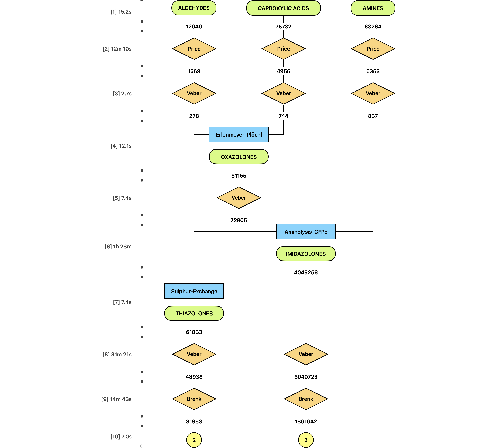

# Design and Synthesis of Cyclooxygenase Inhibitors

**Bachelor's Thesis (Trabajo de Fin de Grado)**  
Universidad de Zaragoza, 2025–26  
**Author:** Darío M. Lorente ([@dariomlorente](https://github.com/dariomlorente))  
**Supervisors:** Dr. Juanvi Alegre-Requena ([@jvalegre](https://github.com/jvalegre)) & Itzel Muro Puente ([@italemp](https://github.com/italemp))

---

## Overview

Cyclooxygenase-2 (COX-2) selective inhibitors, commonly known as *coxibs*, are a class of non-steroidal anti-inflammatory drugs (NSAIDs) designed to provide pain and inflammation relief while significantly reducing the gastrointestinal side effects associated with traditional, non-selective NSAIDs (which also inhibit COX-1).

This repository houses the **computational design** component of a hybrid experimental-computational drug discovery pipeline. The objective is to design, filter, and evaluate novel imidazolone- and thiazolone-based scaffolds to identify highly selective COX-2 inhibitors. 

To ensure the resulting candidates are practical for real-world laboratory synthesis, the pipeline is strictly constrained to use commercially available, cost-effective building blocks.

## The Computational Pipeline

The workflow is divided into three sequential phases, each orchestrated by a dedicated Jupyter Notebook. The process moves from massive virtual combinatorial chemistry down to precise 3D structural evaluation.

### [Phase 1: Virtual Library Generation](01_LIBRARY_GENERATION.ipynb)
**Objective:** Synthesize a vast *in silico* library and remove impractical or toxic compounds.
* **Combinatorial Synthesis:** Assembles virtual compounds using three reaction pathways (Erlenmeyer–Plöchl, Aminolysis, and Sulphur exchange) based on commercial aldehydes, carboxylic acids, and amines.
* **Economic Constraints:** Integrates live data from the Enamine Store API to immediately discard reactions exceeding a strict molecular budget.
* **Drug-likeness & Safety:** Applies rigorous ADMET filtering, including Veber criteria for oral bioavailability, and Brenk/PAINS filters to remove structural alerts and assay-interfering motifs.

### [Phase 2: Hit Prioritisation](02_HIT_PRIORITISATION.ipynb)
**Objective:** Narrow the library to a small, diverse, and highly promising shortlist.
* **Bioavailability Profiling:** Enforces a composite filter requiring compounds to pass at least 4 out of 5 established pharmaceutical rule sets (Lipinski, Ghose, Egan, Muegge, Veber).
* **Machine Learning (QSAR):** Deploys Random Forest models trained on ChEMBL biological assay data. Every compound is ranked by its predicted ability to potently inhibit COX-2 while sparing COX-1.
* **Chemical Clustering:** Utilizes ALMOS to cluster the top-scoring compounds by structural similarity, extracting only the most diverse representative candidates to avoid testing redundant molecules.

### [Phase 3: Docking & Grading](03_DOCKING_GRADING.ipynb)
**Objective:** Validate candidates through 3D structural simulation against the target proteins.
* **Molecular Docking:** Utilizes AutoDock Vina to simulate how each candidate binds to the 3D crystal structures of both COX-2 (therapeutic target) and COX-1 (off-target).
* **Geometric Scoring:** Analyzes the predicted binding poses for critical molecular interactions, such as anchoring to Arg120/Tyr355 and the successful occupation of the COX-2 specific side-pocket.
* **Final Ranking:** Computes a composite score blending the ML-predicted selectivity, thermodynamic docking energy, and geometric fit to produce the final shortlist for experimental synthesis.

## Repository Structure

The project is organized by phase, with distinct environments and data folders to maintain clarity.

| Path | Description |
|------|-------------|
| [`01_LIBRARY_GENERATION.ipynb`](01_LIBRARY_GENERATION.ipynb) | Phase 1 interactive notebook. |
| [`02_HIT_PRIORITISATION.ipynb`](02_HIT_PRIORITISATION.ipynb) | Phase 2 interactive notebook. |
| [`03_DOCKING_GRADING.ipynb`](03_DOCKING_GRADING.ipynb) | Phase 3 interactive notebook. |
| [`01_library_mols_data/`](01_library_mols_data) | Phase 1 datasets, building blocks, and source modules. |
| [`02_selected_mols_data/`](02_selected_mols_data) | Phase 2 datasets, ChEMBL data, and source modules. |
| [`03_docking_pdbqts_data/`](03_docking_pdbqts_data) | Phase 3 datasets, PDB receptor files, and source modules. |

*Note: Detailed, technical READMEs regarding the underlying Python modules, checkpoint systems, and file naming conventions can be found inside each respective data folder.*

## Getting Started

The pipeline relies on Conda for environment management. Each phase has a tailored environment to prevent dependency conflicts.

```bash
# Clone the repository
git clone https://github.com/dariomlorente/coxib-drug-design.git
cd coxib-drug-design

# Setup Phase 1 Environment
conda env create -f 01_library_mols_data/modules/synthesis.yml
conda activate synthesis
```

Environments for subsequent phases can be built as needed:
```bash
conda env create -f 02_selected_mols_data/modules/clustering.yml
conda env create -f 03_docking_pdbqts_data/modules/docking.yml
```

---

## Appendix: Workflow Diagrams

For a detailed view of the data structures, caching mechanisms, and logic gates used within the notebooks, refer to the flowcharts below.

### [Phase 1: Virtual Library Generation](01_LIBRARY_GENERATION.ipynb)


### [Phase 2: Hit Prioritisation](02_HIT_PRIORITISATION.ipynb)


### [Phase 3: Docking & Grading](03_DOCKING_GRADING.ipynb)


---
*Distributed under the Apache 2.0 License. See `LICENSE` for more information.*
