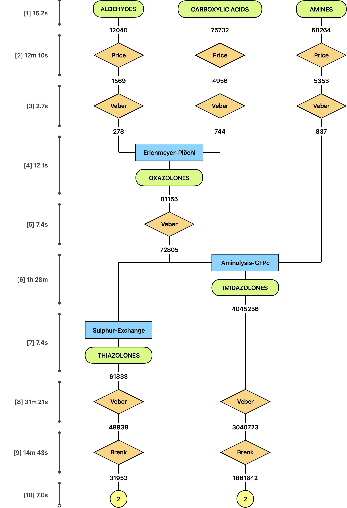
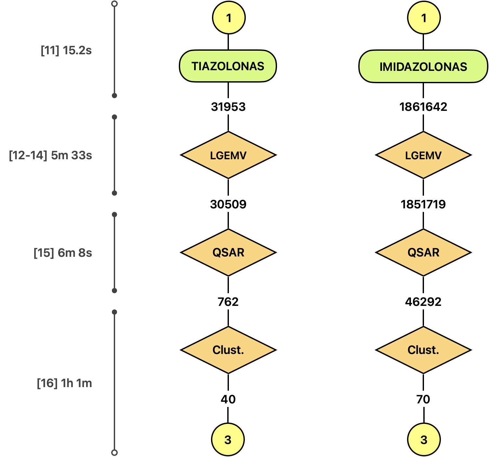
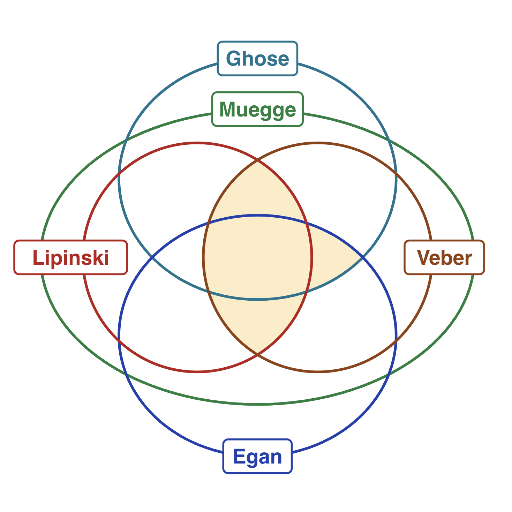

# Figures

## 01_library_generation.png

Flowchart of the Jupyter Notebook 01_LIBRARY_GENERATION.ipynb

## 02_hit_priorisation.png

Flowchart of the Jupyter Notebook 02_HIT_PRIORISATION.ipynb

## 03_docking_grading.png

Flowchart of the Jupyter Notebook 03_DOCKING_GRADING.ipynb

## LGEMV_selected.png

A graph illustrating the set intersections selected throughout 01_LIBRARY_GENERATION.ipynb and in 02_HIT_PRIORISATION.ipynb

## QED_selected.png

A graph created using ggplot2 that showes the distribution of QED (Quantitative Estimate of Drug-likeness) scores following application of the filter from the `02_hit_prioritisation.ipynb` section. The sample consists of the 2878135 compounds registered in ChEMBL, of which 1714702 were accepted and 1163433 were rejected.